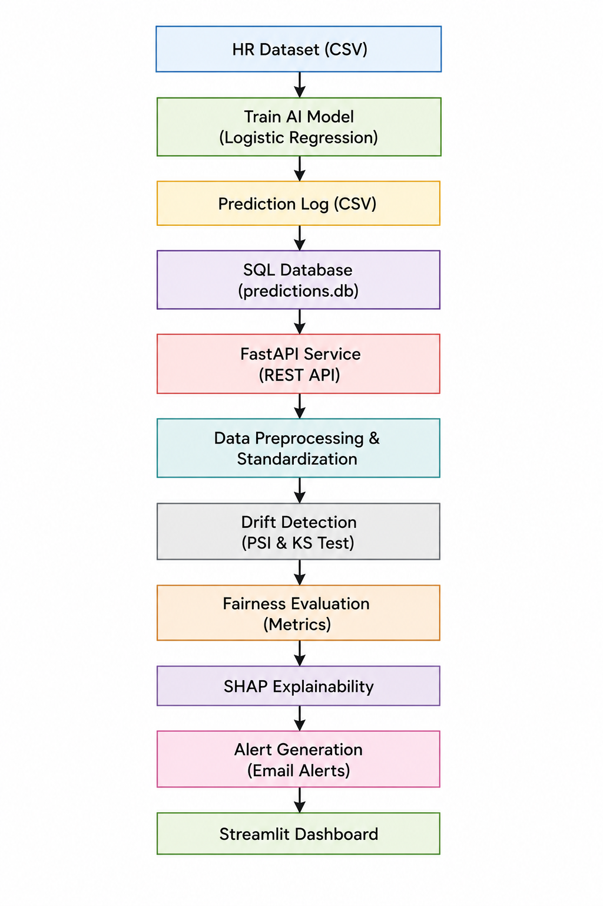
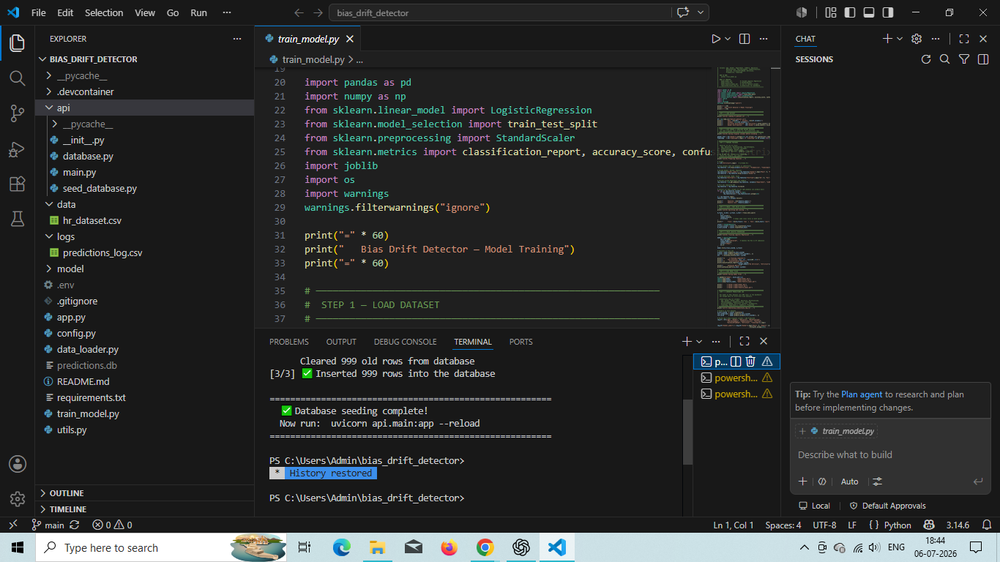
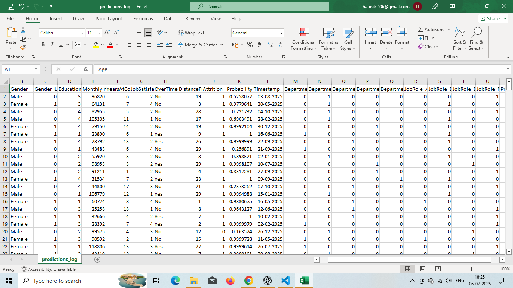
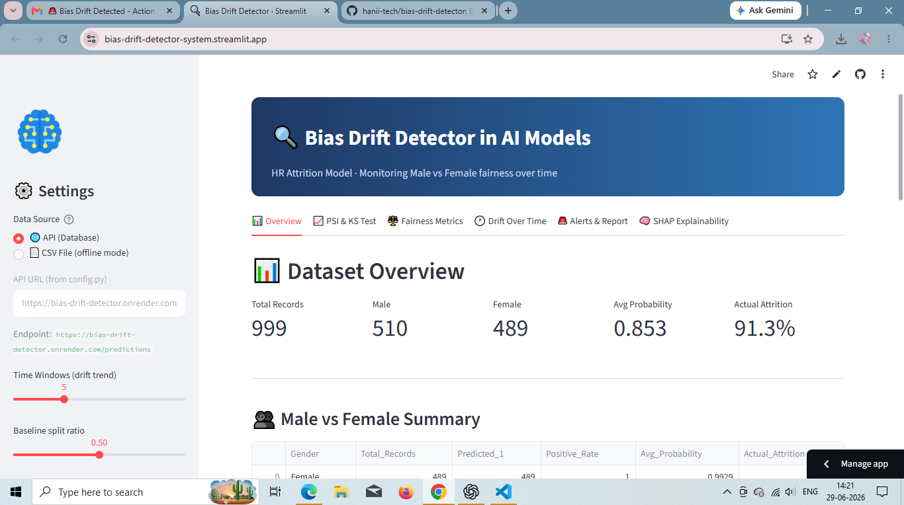
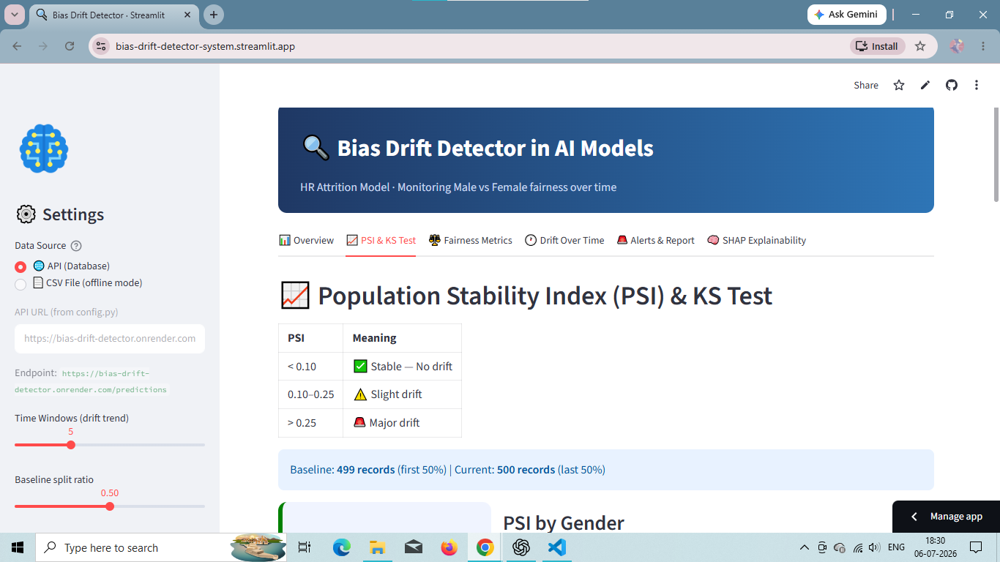
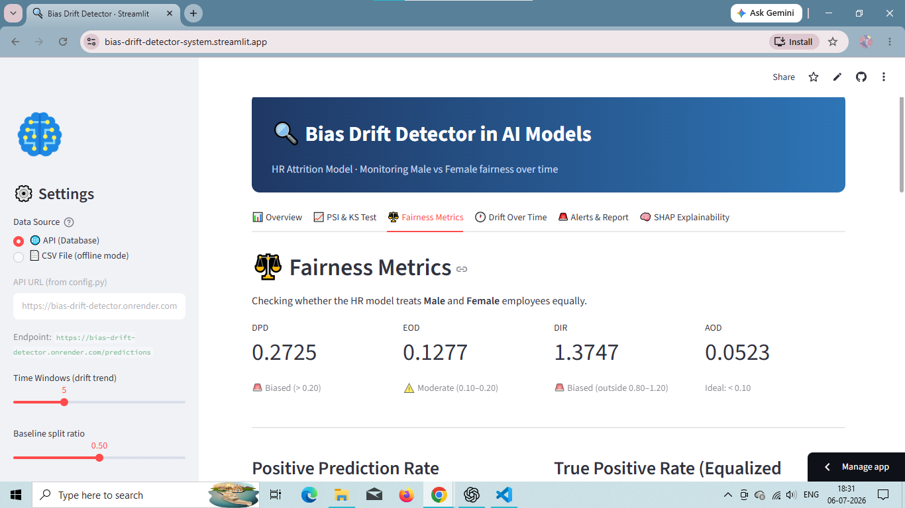
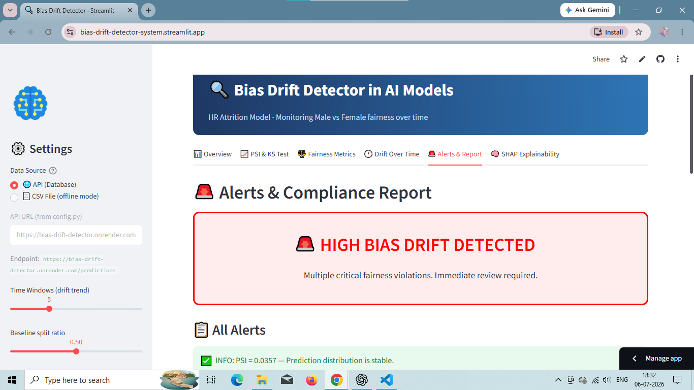
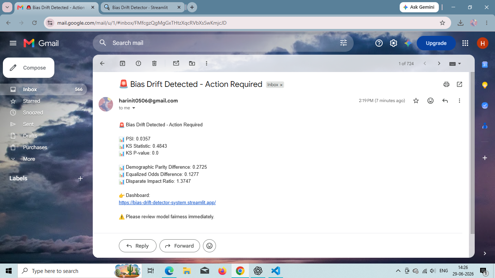

# Bias Drift Detector System for AI Models

## Overview

Bias Drift Detector System is a production-style AI monitoring application that detects data drift, bias drift, and fairness issues in machine learning predictions. The system provides an interactive dashboard, REST API, SQL database integration, automated compliance reporting, and email-based alerting for critical fairness violations.

This project simulates how organizations monitor deployed AI models in real-world environments.

---

## Features

### Model Monitoring

* Population Stability Index (PSI) calculation
* Kolmogorov-Smirnov (KS) statistical testing
* Bias drift tracking over time
* Fairness metric monitoring

### Fairness Analysis

* Demographic Parity Difference (DPD)
* Equalized Odds Difference (EOD)
* Disparate Impact Ratio (DIR)
* Gender-based fairness evaluation

### Dashboard

* Interactive Streamlit dashboard
* Real-time monitoring view
* Compliance reporting
* Alert management
* Downloadable reports

### API Layer

* FastAPI backend
* REST endpoints for prediction retrieval
* Health monitoring endpoint
* Swagger API documentation

### Database Integration

* SQLite database storage
* Prediction log persistence
* Automated database seeding
* Historical monitoring support

### Email Alert System

* Automatic email notifications
* Critical bias detection alerts
* Drift warning notifications
* Dashboard link included in alert emails
* Gmail SMTP integration using App Passwords

---

## System Architecture



### HR Dataset

The system begins with an HR dataset containing employee information such as age, department, job satisfaction, salary, gender, and attrition status. This dataset serves as the input for training the prediction model.

### Train AI Model (Logistic Regression)

A Logistic Regression model is trained using the HR dataset to predict employee attrition. The trained model, feature scaler, and feature names are saved for later use in prediction and explainability.

### Prediction Log

After training, the model generates prediction logs containing prediction probabilities, predicted labels, actual outcomes, and demographic attributes. These logs simulate the outputs produced by an AI model.

### Data Preprocessing

The prediction logs are cleaned and prepared for analysis by handling missing values, formatting data types, and organizing the information required for bias and drift detection.

### Drift Detection (PSI & KS Test)

The system detects changes in prediction distributions over time using Population Stability Index (PSI) and the Kolmogorov–Smirnov (KS) Test. These statistical techniques identify whether significant data or prediction drift has occurred.

### Fairness Evaluation

Fairness metrics such as Demographic Parity Difference, Disparate Impact Ratio, and Equal Opportunity Difference are calculated to evaluate whether the AI model treats different demographic groups fairly.

### SHAP Explainability

SHAP (SHapley Additive exPlanations) is used to explain the model's predictions by identifying which features contribute the most to prediction outcomes and potential fairness differences.

### Alert Generation (Email Alerts)

When the calculated drift or fairness metrics exceed predefined thresholds, the system automatically generates an email alert to notify users of potential bias drift requiring attention.

### Streamlit Dashboard

The final results are presented through an interactive Streamlit dashboard, where users can monitor drift statistics, fairness metrics, SHAP explanations, alert status, and download compliance reports.
---

## Technology Stack

### Backend

* Python
* FastAPI
* SQLAlchemy
* Uvicorn

### Dashboard

* Streamlit
* Plotly

### Data Processing

* Pandas
* NumPy
* SciPy

### Machine Learning

* Scikit-learn

### Database

* SQLite

### Notifications

* SMTP
* Gmail App Password Authentication

### Deployment

* Render (API)
* Streamlit Community Cloud (Dashboard)
* GitHub

---

## API Endpoints

### Health Check

GET `/health`

Returns API status information.

### Predictions

GET `/predictions`

Returns prediction records from the database.

### API Documentation

GET `/docs`

Interactive Swagger documentation.

---

## Installation

### Clone Repository

```bash
git clone https://github.com/hanii-tech/bias-drift-detector.git
cd bias-drift-detector
```

### Install Dependencies

```bash
pip install -r requirements.txt
```

---

## Local Setup

### Step 1 – Train Model

```bash
python train_model.py
```

Generates:

```text
logs/predictions_log.csv
```

### Step 2 – Seed Database

```bash
python api/seed_database.py
```

Loads prediction data into SQLite.

### Step 3 – Start API

```bash
uvicorn api.main:app --reload
```

API available at:

```text
http://127.0.0.1:8000
```

### Step 4 – Launch Dashboard

```bash
streamlit run app.py
```

Dashboard available at:

```text
http://localhost:8501
```

---

## Deployment

### API Deployment

Hosted using Render.

API URL: https://bias-drift-detector.onrender.com

### Dashboard Deployment

Hosted using Streamlit Community Cloud.

Dashboard URL: https://bias-drift-detector-system.streamlit.app

---

## Project Structure

```text
bias_drift_detector/
│
├── api/
│   ├── main.py
│   ├── database.py
│   └── seed_database.py
│
├── logs/
│   └── predictions_log.csv
│
├── app.py
├── config.py
├── data_loader.py
├── utils.py
├── train_model.py
├── requirements.txt
└── README.md
```

---

## Future Improvements

* PostgreSQL integration
* Authentication and user management
* Multi-model monitoring
* Scheduled background jobs
* Slack and Microsoft Teams alerts
* Docker deployment
* CI/CD pipeline integration

---

## Screenshots 

### Code overview


### Generated Prediction Log


### Overview Tab


### Drift Detection Tab


### Fairness Metrics Tab


### Alerts & Report


### SHAP Explainability Tab


### Emali Alert


---

## Author

Harini T 

Aspiring Software Engineer with AI and Data Focus

Focused on building AI-powered, data-driven software applications and monitoring systems.
